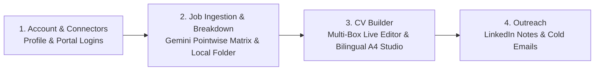

# 🚀 Career System — Bazuka to hit jobs!

<div align="center">


**An autonomous, privacy-first local AI Career Studio & Job Application Engine.**  
*Developed by **Harsh Sahu***

[](LICENSE)
[](https://www.python.org/)
[](https://fastapi.tiangolo.com/)
[](https://tailwindcss.com/)
[](https://ai.google.dev/)
[]()

[Features](#-key-features) • [Quick Start](#-quick-start) • [4-Step Wizard](#-the-4-step-application-pipeline) • [Systematic Nomenclature](#-systematic-nomenclature--local-storage) • [Google Drive Sync](#-google-drive-1-click-sync) • [Collaboration](#-collaborator--developer-guide)

</div>

---

## 🌟 Overview

**Career System** is an all-in-one, local web application that automates the entire job hunt lifecycle: from ingesting job postings (URL, PDF, or text) to extracting pointwise requirements with **Google Gemini AI**, building tailored **bilingual A4 CVs & Cover Letters** (English UK & Deutsch), and generating tailored outreach pitches.

### 🛡️ Privacy-First Architecture
- **100% Local Execution**: All data, portal credentials, and generated application files are saved locally on your computer in an encrypted SQLite database and dedicated local folders.
- **Zero Preloaded Data**: The repository is completely clean of personal credentials and job ads.
- **Git-Ignored Personal Data**: All generated resumes, cover letters, and downloaded job PDFs inside `jobs/` are automatically untracked and excluded from Git commits.

---

## ⚡ Quick Start

### 1. Launch with One Click (Windows)
Double-click [`start_career_system.bat`](start_career_system.bat) (or run in terminal):
```powershell
.\start_career_system.bat
```
The app automatically:
1. Verifies your Python virtual environment and installs any missing packages.
2. Starts the local FastAPI server.
3. Automatically opens **`http://localhost:8000`** in your default web browser!

### 2. Run Self-Diagnostics & Doctor
To verify your system health, run:
```powershell
.\test_system.bat
```
*(Runs 10 diagnostic checks testing Python runtime, package dependencies, SQLite migrations, Gemini parser, bilingual HTML compiler, and REST API endpoints).*

---

## 🧭 The 4-Step Application Pipeline



### 1️⃣ Step 1: Account & Connectors
- **Applicant Profiles**: Switch between candidate profiles or create new profiles in 1 click.
- **Job Portal Connectors**: Store login credentials locally for gated job boards (LinkedIn, Stepstone, Indeed) to enable automated scraping.
- **Google Drive Cloud Sync**: Set up 1-click cloud folder upload via zero-configuration Google Apps Script.
- **Google Gemini AI Key**: Configure your API key for intelligent job analysis.

### 2️⃣ Step 2: Job Ingestion & Pointwise Breakdown
- **3 Ingestion Modes**: Ingest job postings via **Direct URL**, **PDF Upload**, or **Raw Text Paste**.
- **Pointwise Gemini Breakdown**:
  - Key Responsibilities & Deliverables (pointwise list)
  - Tech Stack & Tools tags
  - Must-Have Qualifications (pointwise list)
  - Language Requirements (e.g. English C1, German B2)
  - Benefits & Perks
  - Profile Fit Score % and Matched Strengths vs Missing Gap Keywords
- **Editable Metadata**: Instant dropdowns for Employment Type (*Full-time, Part-time, Ausbildung, Internship, Werkstudent, Freelance*), Contract Type (*Permanent / Unbefristet, Temporary / Befristet*), and Seniority.
- **Stored Opportunities Database**: View, manage, filter, and delete opportunities.

### 3️⃣ Step 3: CV Builder (Bilingual EN-UK & DE)
- **Instant Live A4 Rendering**: Renders pixel-perfect ISO 216 A4 (210mm × 297mm) HTML documents in <10ms with zero compilation bottlenecks.
- **Bilingual Switcher**: Switch instantly between **🇬🇧 English (UK)** and **🇩🇪 Deutsch**.
- **Live Multi-Box Editor**: Dedicated real-time editing boxes for:
  - **Summary**: Executive Profile / Zusammenfassung
  - **Experience**: Edit titles, institutions, dates, and individual bullet points (`+ Add Role`, `+ Add Bullet`, `🗑️ Remove`)
  - **Education**: Edit degrees, universities, years, and grades
  - **Skills**: Comma-separated boxes for Domains, Software, Hardware, Languages, Credentials & Work Authorization
  - **Contact Info**: Name, Title, Location, Phone, Email, LinkedIn
- **CV Profile Picture**:
  - Square photo box (`68px × 68px`) placed in the top-left corner alongside your Name and Title.
  - **Auto-Omission**: If no photo is uploaded, the photo box is completely removed from the CV with no empty gaps.
- **"Why I Fit" AI Synthesis**: Input your thoughts/projects and click *"Synthesize with AI"* to adapt your cover letter and bullets.
- **Direct Actions**: Print / Save to PDF, Open Local Folder in Windows Explorer, and 1-Click Upload to Google Drive.

### 4️⃣ Step 4: Outreach
- Automatically drafts tailored **LinkedIn Connection Notes (< 300 characters)**, **LinkedIn InMails**, and **Cold Emails**.
- 1-Click Copy to Clipboard.

---

## 📁 Systematic Nomenclature & Local Storage

Every single application generates a dedicated, uncompressed folder on your PC following standard systematic nomenclature:

```text
career_system/jobs/{jobposition}_{jobID}_{companyname}/
├── {jobposition}_{jobID}_{companyname}_description.pdf      # Original Job PDF / Scrape
├── {jobposition}_{jobID}_{companyname}_meta_data.json       # Structured Metadata & Analysis
├── {jobposition}_{jobID}_{companyname}_photo.jpg            # Optional CV Profile Photo
├── {jobposition}_{jobID}_{companyname}_cv_en.html           # A4 English (UK) CV
├── {jobposition}_{jobID}_{companyname}_cv_de.html           # A4 German (DE) CV
├── {jobposition}_{jobID}_{companyname}_coverletter_en.html  # A4 English Cover Letter
├── {jobposition}_{jobID}_{companyname}_coverletter_de.html  # A4 German Cover Letter
└── {jobposition}_{jobID}_{companyname}_outreach.txt         # Outreach Pitches
```

> [!TIP]
> Click **"📁 Open Local Folder"** anywhere in the web app to immediately launch **Windows File Explorer** inside that job's uncompressed folder.

---

## ☁️ Google Drive 1-Click Sync

Prefer backing up to Google Drive? The app includes 1-click cloud sync:

1. Open [script.google.com](https://script.google.com) and click **New Project**.
2. Paste the script template found in **Step 1 &rarr; Setup Guide**.
3. Click **Deploy &rarr; New Deployment &rarr; Web App**:
   - **Execute as**: `Me`
   - **Who has access**: `Anyone`
4. Copy the Web App URL (ends in `/exec`) and paste it into **Step 1**.
5. Click **"☁️ Upload Folder to Google Drive"** on any job — it automatically creates a `CareerSystem_Jobs/{jobposition}_{jobID}_{companyname}/` folder in your Google Drive and uploads all uncompressed files!

---

## 👥 Collaborator & Developer Guide

### Project Structure
```text
career_system/
├── app.py                      # FastAPI server & REST API endpoints
├── start_career_system.bat     # 1-Click launcher script
├── test_system.py              # 10-point diagnostic test suite
├── src/
│   ├── ai_assistant.py         # Google Gemini AI breakdown & fit synthesis
│   ├── database.py             # SQLite database manager & folder prefix engine
│   ├── extractor.py            # Pointwise PDF/text extractor
│   ├── google_sync.py          # Google Drive cloud sync & webhook handler
│   ├── html_templates.py       # Bilingual A4 HTML/CSS template engine
│   ├── matcher.py              # Keyword matching & fit score calculator
│   ├── scraper.py              # Web scraper for job portals
│   └── tracker.py              # Contact & outreach tracking
├── static/
│   ├── app.js                  # Alpine.js reactive application logic
│   ├── style.css               # Dark high-contrast styling & scrollbars
│   ├── icon.png                # Brand favicon & logo
│   └── gemini_logo.png         # Official Google Gemini badge
└── templates/
    └── index.html              # Modern, high-contrast dark UI (Tailwind CSS)
```

### Contributing & Pushing Advancements
Collaborators can benefit from your advancements by pulling changes:
```bash
git checkout -b feature/my-enhancement
# Make changes
python test_system.py
git commit -m "feat: Describe your enhancement"
git push origin feature/my-enhancement
```

---

## 📄 License
This project is open-source and available under the [MIT License](LICENSE).
