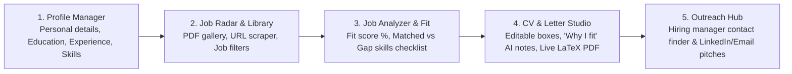

# Anti-Gravity: Career System Local Web App & AI Job Studio

A self-contained, local **AI Career Studio and Application Pipeline** designed for **Harsh Sahu**, **Neha Sahu**, and **Ayush Sahu**. 

Anyone can clone this repository and launch a rich, local web application on their PC with **one click** (`start_web.bat` or `python app.py`) to manage their profile, scrape and catalog job postings, analyze fit scores, interactively build LaTeX CVs & Cover Letters, and generate hiring team outreach.

---

## ⚡ Quick Start for Collaborators (2 Easy Steps)

### Step 1: Run the Self-Testing & Diagnostic Tool
Double-click [`test_system.bat`](file:///d:/Job%20Application/test_system.bat) (or run `./test_system.sh` on macOS/Linux).
- It automatically checks Python, installs `uv`, creates `.venv`, installs dependencies, verifies LaTeX, and tests database/API health.
- If anything is missing, it **repairs and installs it automatically** on the spot!

### Step 2: Launch the Web App
Double-click [`start_web.bat`](file:///d:/Job%20Application/start_web.bat) (or run `./start_web.sh` on macOS/Linux).
- Opens **`http://localhost:8000`** in your browser automatically!

---

## 🌟 5 Core Web Application Modules



1. **👤 1. Profile Manager (Local DB Form)**:
   - Enter your personal details, education history, work experience, and technical skills once.
   - Saves locally to SQLite and automatically syncs with YAML profiles (`profiles/<name>/profile.yaml`).
   - Switch between **Harsh**, **Neha**, **Ayush**, or create a new profile with 1 click.
2. **📡 2. Job Radar & Library**:
   - Visual gallery of all local job PDFs with status tracking (*New, In Progress, Applied, Interview, Offer, Rejected*).
   - Add new jobs via **URL pasting** (auto-scraped and saved as PDF) or **direct PDF drag-and-drop**.
   - Search/filter roles by location (e.g. *Hamburg*) with 1-click archiving.
3. **🎯 3. Job Analyzer & Fit Matrix**:
   - Analyzes any job description, extracts must-have skills, and calculates a **Profile Fit Score %**.
   - Highlights **Matched Strengths** (green) and **Missing Gap Skills** (amber) to include in your resume.
4. **✍️ 4. Interactive CV & Cover Letter Studio**:
   - **Editable Section Boxes**: View and edit your Executive Summary, bullets, and cover letter paragraphs in real-time.
   - **"Why I Fit" AI Notes Box**: Write your custom thoughts on why you want the job -> click **"Analyze with AI"** for Gemini/Anti-Gravity suggestions to strengthen your cover letter and bullets.
   - **1-Click Live PDF Compilation**: Click *"Compile LaTeX PDF"* to run XeLaTeX and view/download the generated PDF right inside the browser.
5. **🤝 5. Hiring Team & Outreach Hub**:
   - Manage hiring manager and recruiter contacts.
   - 1-Click generated **LinkedIn Connection Notes** (under 300 chars), **InMails**, and **Cold Emails**.

---

## 🛠️ Diagnostics & Diagnostic Reports

To run the automated diagnostic doctor anytime:
```powershell
# Windows
.\test_system.bat

# macOS / Linux
./test_system.sh
```

---

## 🧠 Optional Google Gemini API Integration

The system works **100% offline** out of the box using built-in NLP heuristics and XeLaTeX.
To unlock advanced generative reasoning for the "Why I Fit" AI notes:
1. Click the **Gear (Settings)** icon in the top right corner of the web app.
2. Paste your **Google Gemini API Key**.

---

## 🛠️ CLI Pipeline Commands

You can also run all pipeline actions directly from the command line:

```powershell
# Check status
.venv\Scripts\python.exe pipeline.py status

# Run diagnostic suite
.venv\Scripts\python.exe test_system.py

# Scrape a job posting from a URL
.venv\Scripts\python.exe pipeline.py scrape --url "https://..." --name "Company_Role"

# Ingest a manual PDF
.venv\Scripts\python.exe pipeline.py ingest --pdf-path "job_ads_manual/Sample_Job.pdf"

# Analyze all jobs in the database
.venv\Scripts\python.exe pipeline.py analyze

# Generate tailored CV & Cover Letter (Harsh / Neha / Ayush)
.venv\Scripts\python.exe pipeline.py generate --profile neha --company "Arcadis" --role "Data Analyst" --lang en
```
